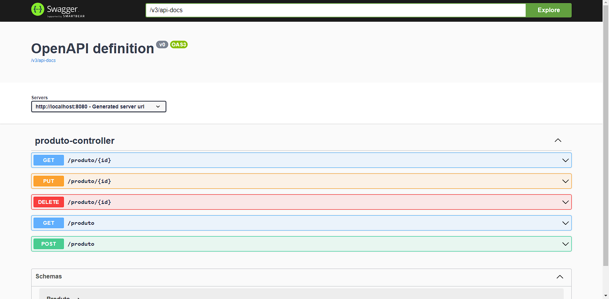

# Produto API Spring

API de produto desenvolvida utilizando Java e Spring, tendo a possibilidade de salvar os dados inseridos na API por conta do banco de dados H2.

Url para acessar a interface OpenAPI: http://localhost:8080/swagger-ui/index.html

Tecnologias utilizadas:
 
 

 
 

